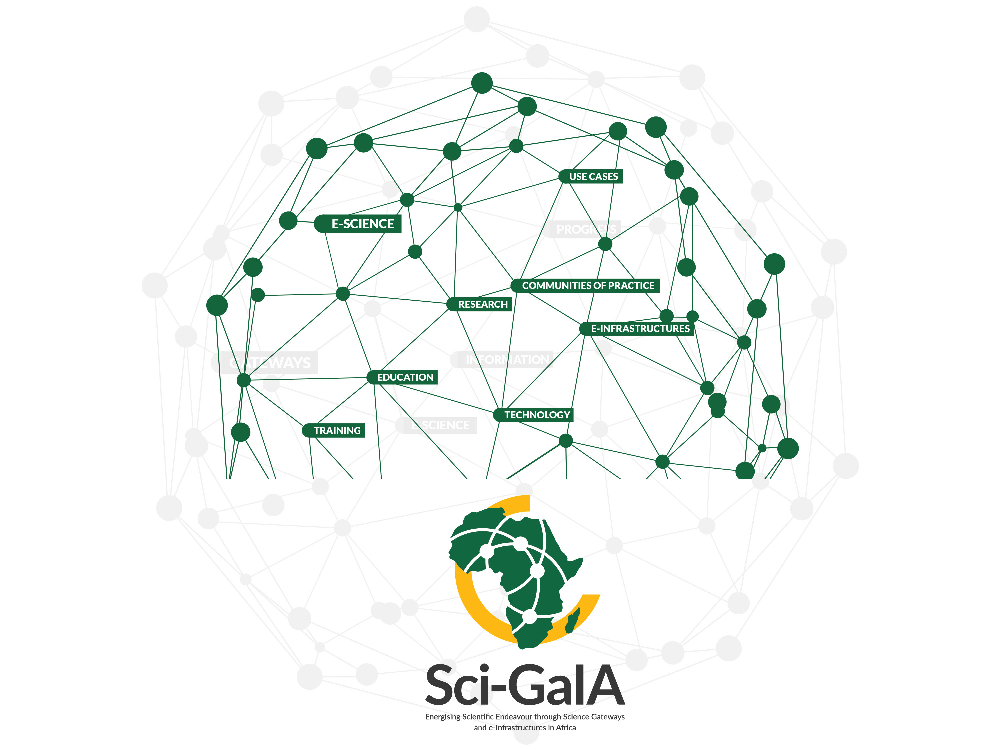

---
author:
- name: Bruce Becker
  email: bbecker@csir.co.za
  institute: CSIR Meraka Institute
title: "Sci-GaIA Deliverable 3.1 : e-Infrastructure Sentinel Report"
tablenos-caption-name: Table
tablenos-plus-name: Table
tablenos-cleveref: On
fignos-cleveref: On
fignos-plus-name: Fig.
link-citations: True
bibliography: bibliography.yaml
references:
  - id: noauthor_participating_nodate
    type: no-type
    accessed:
    - year: '2017'
      month: '6'
      day: '9'
    title: Participating Countries - SKA Telescope
    URL: http://skatelescope.org/participating-countries/

  - id: insights
    title: 'Bridging the digital divide: skills for the new age'
    issued:
      year: '2017'
      month: '3'
    url: 'http://www.g20-insights.org/policy_briefs/bridging-digital-divide-skills-new-age/'
    container-title: G20 Policy Briefs
    publisher: G20 Insights
    author:
      - family: Chetty
        given: K
      - family: Aneja
        given: U
      - family: Mishra
        given: V
      - family: Gcora
        given: N
      - family: Josie
        given: J
  - id: ITUpricing
    title: "Study on International Internet Connectivity in Sub-Saharan Africa"
    issued:
      year: "2013"
      month: "3"
    url: "https://www.itu.int/en/publications/ITU-D/pages/publications.aspx?parent=D-PREF-EF.IIC.AFR-2013&media=electronic"
    doi: "http://handle.itu.int/11.1002/pub/80981022-en"
    author:
      - family: Abossé
        given: Akue-Kpakpo
    container-title: "ITU publications on economics & finance"
  - id: CHAIN
    title:
    issued:
      year:
      month:
    url:
    doi:
    author:
      - family:
        given:
  - id: barbera2014chain
    type: article-journal
    author:
    - family: Barbera
      given: Roberto
    - family: Becker
      given: Bruce
    - family: Carrubba
      given: Carla
    - family: Inserra
      given: Giuseppina
    - family: Jalife Villalón
      given: Salma
    - family: Kanellopoulos
      given: Christos
    - family: Koumantaros
      given: Kostas
    - family: Mayo-García
      given: Rafael
    - family: Villavicencio
      given: Luis Núñez
      dropping-particle: de
    - family: Prnjat
      given: Ognjen
    - literal: others
    issued:
    - year: '2014'
    title: A CHAIN-REDS solution for accessing computational services
    publisher: Red CLARA (Cooperación Latino Americana de Redes Avanzadas
  - id: prnjat_enabling_2015
    type: paper-conference
    author:
    - family: Prnjat
      given: Ognjen
    - family: Becker
      given: Bruce
    - family: Barbera
      given: Roberto
    - family: Kanellopoulos
      given: Christos
    - family: Koumantaros
      given: Kostas
    - family: Mayo-Garcia
      given: Rafael
    - family: Ruggieri
      given: Federico
    issued:
    - year: '2015'
      month: '5'
    accessed:
    - year: '2017'
      month: '6'
      day: '6'
    title: Enabling intercontinental e-Infrastructures - a case for Africa
    publisher: IEEE
    page: '1-7'
    URL: http://ieeexplore.ieee.org/document/7190535/
    DOI: 10.1109/ISTAFRICA.2015.7190535
    ISBN: '9781905824519'
  - id: andronico2011infrastructures
    type: article-journal
    author:
    - family: Andronico
      given: Giuseppe
    - family: Balaž
      given: Antun
    - family: Banda
      given: Tiwonge Msulira
    - family: Barbera
      given: Roberto
    - family: Becker
      given: Bruce
    - family: Chattopadhyay
      given: Subrata
    - family: Chen
      given: Gang
    - family: Ciuffo
      given: Leandro N
    - family: Dhekne
      given: PS
    - family: Gavillet
      given: Philippe
    - literal: others
    issued:
    - year: '2011'
    title: E-infrastructures for international cooperation
    container-title: 'Computational and Data Grids: Principles, Applications and Design:
      Principles, Applications and Design'
    publisher: IGI Global
    page: '141'
    references:
  - id: song_sub-saharan_2016
    type: no-type
    author:
    - family: Song
      given: Steve
    issued:
    - year: '2016'
      month: '6'
    accessed:
    - year: '2017'
      month: '6'
      day: '6'
    title: Sub-saharan Undersea Cables in 2018 - maybe (version 45)
    abstract: Jun 2016 ======= Updated map to reflect DARE cable. &lt;a href=“http://www.teams.co.ke/dare/”
      rel=“nofollow”&gt;www.teams.co.ke/dare/&lt;/a&gt;
    keyword: ace, africa, cable, cbcs, dare, eassy, fibre, glo1, lion, mainone, ncscs,
      optic, sat3, seacom, teams, undersea, wacs
    URL: https://www.flickr.com/photos/ssong/27665889970/
  - id: internet_society_international_2016
    type: no-type
    author:
    - literal: Internet Society
    issued:
    - year: '2016'
      month: '9'
    accessed:
    - year: '2017'
      month: '6'
      day: '6'
    title: International Bandwidth and Pricing Trends in Sub-Sahara Africa
    abstract: By Patrick Christian (Telegeography) AfPIF 2016, 30 Aug 2016
    URL: https://www.slideshare.net/InternetSociety/international-bandwidth-and-pricing-trends-in-subsahara-africa
  - id: noauthor_afterfibre_nodate
    type: no-type
    accessed:
    - year: '2017'
      month: '6'
      day: '6'
    title: AfTerFibre (African Terrestrial Fibre)
    container-title: AfTer Fibre
    URL: https://afterfibre.nsrc.org/#aftAbout
  - id: nungu_design_2011
    type: paper-conference
    author:
    - family: Nungu
      given: Amos
    - family: Olsson
      given: Robert
    - family: Pehrson
      given: Bjorn
    issued:
    - year: '2011'
      month: '6'
    accessed:
    - year: '2017'
      month: '6'
      day: '6'
    title: On the design of inclusive ubiquitous access
    publisher: IEEE
    page: '346-352'
    URL: http://ieeexplore.ieee.org/document/5949189/
    DOI: 10.1109/ICUFN.2011.5949189
    ISBN: '9781457711763'
  - id: '6877518'
    type: paper-conference
    author:
    - family: Dart
      given: 'E.'
    - family: Rotman
      given: L.
    - family: Tierney
      given: B.
    - family: Hester
      given: M.
    - family: Zurawski
      given: J.
    issued:
    - year: '2013'
      month: Nov
    title: 'The science dMZ: A network design pattern for data-intensive science'
    title-short: The science dMZ
    container-title: 2013 sC - international conference for high performance computing,
      networking, storage and analysis (sC)
    page: '1-10'
    keyword: data communication;natural sciences computing;scientific information systems;cyberinfrastructure;cybersecurity;data
      transfer performance;data-intensive science;high-capacity connections;network
      design pattern;network design patterns;performance tools;remote computing systems;science
      DMZ paradigm;scientific data;scientific discovery;supercomputing centers;system
      configuration;universities;Data transfer;Monitoring;Packet loss;Security;Throughput;Wide
      area networks;Design;Measurement;Performance;Reliability
    DOI: 10.1145/2503210.2503245
    ISSN: '2167-4329'
  - id: top500
    type: no-type
    accessed:
    - year: '2017'
      month: '6'
      day: '7'
    title: Performance Development TOP500 Supercomputer Sites
    URL: https://www.top500.org/statistics/perfdevel/
  - id: huttermann_infrastructure_2012
    type: chapter
    author:
    - family: Hüttermann
      given: Michael
    issued:
    - year: '2012'
    accessed:
    - year: '2017'
      month: '6'
      day: '8'
    title: Infrastructure as Code
    container-title: DevOps for Developers
    publisher: Apress
    publisher-place: Berkeley, CA
    page: '135-156'
    note: 'DOI: 10.1007/978-1-4302-4570-4\_9'
    URL: http://link.springer.com/10.1007/978-1-4302-4570-4_9
    ISBN: 9781430245698 9781430245704
  - id: iac_oreilly
    title: Infrastructure as Code
    author:
      given: Kief
      family: Morris
    publisher: "O'Reilly Media"
    ISBN: 978-1-4919-2435-8
    issued:
      - year: '2016'
  - id: europe2014data
    type: article-journal
    author:
    - family: Europe
      given: RDA
    issued:
    - year: '2014'
    title: 'The data harvest: How sharing research data can yield knowledge, jobs
      and growth'
    title-short: The data harvest
    container-title: Retrieved December
    page: '2014'
    volume: '4'
  - id: Durao2014
    type: article-journal
    author:
    - family: Durao
      given: Frederico
    - family: Carvalho
      given: Jose Fernando S.
    - family: Fonseka
      given: Anderson
    - family: Garcia
      given: Vinicius Cardoso
    issued:
    - year: '2014'
    title: A systematic review on cloud computing
    container-title: The Journal of Supercomputing
    page: '1321-1346'
    volume: '68'
    issue: '3'
    abstract: Cloud computing is an ascending technology that has introduced a new paradigm
      by rendering a rational computational model possible. It has changed the dynamics
      of IT consumption by means of a model that provides on-demand services over the
      Internet. Unlike the traditional hosting service, cloud computing services are
      paid for per usage and may expand or shrink based on demand. Such services are,
      in general, fully managed by cloud providers that require users nothing but a
      personal computer and an Internet access. In recent years, this model has attracted
      the attention of researchers, investors and practitioners, many of whom have proposed
      a number of applications, structures and fundamentals of cloud computing, resulting
      in various definitions, requirements and models. Despite the interest and advances
      in the field, issues such as security and privacy, service layer agreement, resource
      sharing, and billing have opened up new questions about the real gains of the
      model. Although cloud computing is based on a 50-year-old business model, evidence
      from this study indicates that cloud computing still needs to expand and overcome
      present limitations that prevent the full use of its potential. In this study,
      we critically review the state of the art in cloud computing with the aim of identifying
      advances, gaps and new challenges.
    URL: http://dx.doi.org/10.1007/s11227-014-1089-x
    DOI: 10.1007/s11227-014-1089-x
    ISSN: '1573-0484'
  - id: hazelhurst2008scientific
    type: paper-conference
    author:
    - family: Hazelhurst
      given: Scott
    issued:
    - year: '2008'
    title: 'Scientific computing using virtual high-performance computing: A case
      study using the amazon elastic computing cloud'
    title-short: Scientific computing using virtual high-performance computing
    container-title: 'Proceedings of the 2008 annual research conference of the south
      african institute of computer scientists and information technologists on iT research
      in developing countries: Riding the wave of technology'
    publisher: ACM
    page: '94-103'
  - id: lecarpentier2013eudat
    type: article-journal
    author:
    - family: Lecarpentier
      given: Damien
    - family: Wittenburg
      given: Peter
    - family: Elbers
      given: Willem
    - family: Michelini
      given: Alberto
    - family: Kanso
      given: Riam
    - family: Coveney
      given: Peter
    - family: Baxter
      given: Rob
    issued:
    - year: '2013'
    title: 'EUDAT: A new cross-disciplinary data infrastructure for science'
    title-short: EUDAT
    container-title: International Journal of Digital Curation
    page: '279-287'
    volume: '8'
    issue: '1'
  - id: treloar2009design
    type: article-journal
    author:
    - family: Treloar
      given: Andrew
    issued:
    - year: '2009'
    title: Design and implementation of the australian national data service
    container-title: International Journal of Digital Curation
    page: '125-137'
    volume: '4'
    issue: '1'
  - id: houssos_openaire_2014
    type: article-journal
    author:
    - family: Houssos
      given: Nikos
    - family: Jörg
      given: Brigitte
    - family: Dvořák
      given: Jan
    - family: Príncipe
      given: Pedro
    - family: Rodrigues
      given: Eloy
    - family: Manghi
      given: Paolo
    - family: Elbæk
      given: Mikael K.
    issued:
    - year: '2014'
    accessed:
    - year: '2017'
      month: '6'
      day: '9'
    title: 'OpenAIRE Guidelines for CRIS Managers: Supporting Interoperability of
      Open Research Information through Established Standards'
    title-short: OpenAIRE Guidelines for CRIS Managers
    container-title: Procedia Computer Science
    page: '33-38'
    volume: '33'
    URL: http://linkinghub.elsevier.com/retrieve/pii/S1877050914007960
    DOI: 10.1016/j.procs.2014.06.006
    ISSN: '18770509'
  - id: noauthor_openaire_nodate
    type: no-type
    accessed:
    - year: '2017'
      month: '6'
      day: '9'
    title: OpenAIRE Guidelines — OpenAIRE Guidelines 3.0 documentation
    URL: https://guidelines.openaire.eu/en/latest/
  - id: noauthor_42_nodate
    type: no-type
    accessed:
    - year: '2017'
      month: '6'
      day: '9'
    title: 42 countries, 174 institutes, 1800 members ALICE Collaboration
    URL: http://alice-collaboration.web.cern.ch/general/index.html

  - id: noauthor_collaboration_2015
    type: no-type
    issued:
    - year: '2015'
      month: '3'
    accessed:
    - year: '2017'
      month: '6'
      day: '9'
    title: The Collaboration
    abstract: '...'
    URL: http://atlas.cern/discover/collaboration
  - id: copley_african_2016
    type: article-journal
    author:
    - family: Copley
      given: C. J.
    - family: Thondikulam
      given: V.
    - family: Loots
      given: A.
    - family: Bangani
      given: S.
    - family: Cloete
      given: K.
    - family: Combrinck
      given: L.
    - family: Gioio
      given: S.
    - family: Ludick
      given: J.
    - family: Nicolson
      given: G.
    - family: Pollak
      given: A. W.
    - family: Pretorius
      given: P.
    - family: Quick
      given: J. F. H.
    - family: Taylor
      given: G.
    - family: Ebrahim
      given: F.
    - family: Humphreys
      given: C.
    - family: Maake
      given: K.
    - family: Maganane
      given: R.
    - family: Majinjiva
      given: R.
    - family: Mapunda
      given: A.
    - family: Manzini
      given: M.
    - family: Mogakwe
      given: N.
    - family: Moseki
      given: A.
    - family: Qwabe
      given: N.
    - family: Royi
      given: N.
    - family: Rosie
      given: K.
    - family: Smith
      given: J.
    - family: Schietekat
      given: S.
    - family: Toruvanda
      given: O.
    - family: Tong
      given: C.
    - family: Niekerk
      given: B.
      dropping-particle: van
    - family: Walbrugh
      given: W.
    - family: Zeeman
      given: W.
    issued:
    - year: '2016'
      month: '8'
    accessed:
    - year: '2017'
      month: '6'
      day: '9'
    title: The African Very Long Baseline Interferometry Network:The Ghana Antenna Conversion
    title-short: The African Very Long Baseline Interferometry Network
    container-title: arXiv:1608.02187 \[astro-ph\]
    note: 'arXiv: 1608.02187'
    abstract: The African Very Long Baseline Interferometry Network (AVN) is a pan-African
      project that will develop Very Long Baseline Interferometry (VLBI) observing capability
      in several countries across the African continent, either by conversion of existing
      telecommunications antennas into radio telescopes, or by building new ones. This
      paper focuses on the conversion of the Nkutunse satellite communication station
      (near Accra, Ghana), specifically the early mechanical and infrastructure upgrades,
      together with the development of a custom ambient receiver and digital backend.
      The paper concludes with what remains to be done, before the station can be commissioned
      as an operational VLBI station.
    keyword: Astrophysics - Instrumentation and Methods for Astrophysics
    URL: http://arxiv.org/abs/1608.02187
  - id: egi-doc-2407-v2
    type: no-type
    author:
    - family: Andreozzi
      given: Sergio
    issued:
    - year: '2015'
      month: '05'
    accessed:
    - year: '2017'
      month: '6'
      day: '11'
    title: 'EGI-doc-2407-v2: Mou between EGI.eu and CSIR Meraka (African-Arabian Region)'
    title-short: EGI-doc-2407-v2
    URL: https://documents.egi.eu/public/ShowDocument?docid=2407
  - id: bruce_becker_2016_208216
    type: article-journal
    author:
    - family: Becker
      given: Bruce
    - family: Torrisi
      given: Mario
    issued:
    - year: '2016'
      month: '12'
    title: 'AAROC/e-Research-Hackfest-prep: e-Research Hackfest
      Preparation : Lagos'
    URL: https://doi.org/10.5281/zenodo.208216
    DOI: 10.5281/zenodo.208216
  - id: Tenhunen:562
    type: article-journal
    author:
    - family: Tenhunen
      given: Hannu
    issued:
    - year: '2017'
      month: May
    title: 'Sci-GaIA Deliverable D2.4 - Energising Scientific
      Endeavour: Experiences of Supporting Communities of Practice with Science Gateways
      and e-Infrastructures'
  - id: wilkinson_fair_2016
    type: article-journal
    author:
    - family: Wilkinson
      given: Mark D.
    - family: Dumontier
      given: Michel
    - family: Aalbersberg
      given: IJsbrand Jan
    - family: Appleton
      given: Gabrielle
    - family: Axton
      given: Myles
    - family: Baak
      given: Arie
    - family: Blomberg
      given: Niklas
    - family: Boiten
      given: Jan-Willem
    - family: Silva Santos
      given: Luiz Bonino
      dropping-particle: da
    - family: Bourne
      given: Philip E.
    - family: Bouwman
      given: Jildau
    - family: Brookes
      given: Anthony J.
    - family: Clark
      given: Tim
    - family: Crosas
      given: Merc?
    - family: Dillo
      given: Ingrid
    - family: Dumon
      given: Olivier
    - family: Edmunds
      given: Scott
    - family: Evelo
      given: Chris T.
    - family: Finkers
      given: Richard
    - family: Gonzalez-Beltran
      given: Alejandra
    - family: Gray
      given: Alasdair J.G.
    - family: Groth
      given: Paul
    - family: Goble
      given: Carole
    - family: Grethe
      given: Jeffrey S.
    - family: Heringa
      given: Jaap
    - family: Hoen
      given: Peter A.C
      dropping-particle: ?t
    - family: Hooft
      given: Rob
    - family: Kuhn
      given: Tobias
    - family: Kok
      given: Ruben
    - family: Kok
      given: Joost
    - family: Lusher
      given: Scott J.
    - family: Martone
      given: Maryann E.
    - family: Mons
      given: Albert
    - family: Packer
      given: Abel L.
    - family: Persson
      given: Bengt
    - family: Rocca-Serra
      given: Philippe
    - family: Roos
      given: Marco
    - family: Schaik
      given: Rene
      dropping-particle: van
    - family: Sansone
      given: Susanna-Assunta
    - family: Schultes
      given: Erik
    - family: Sengstag
      given: Thierry
    - family: Slater
      given: Ted
    - family: Strawn
      given: George
    - family: Swertz
      given: Morris A.
    - family: Thompson
      given: Mark
    - family: Lei
      given: Johan
      dropping-particle: van der
    - family: Mulligen
      given: Erik
      dropping-particle: van
    - family: Velterop
      given: Jan
    - family: Waagmeester
      given: Andra
    - family: Wittenburg
      given: Peter
    - family: Wolstencroft
      given: Katherine
    - family: Zhao
      given: Jun
    - family: Mons
      given: Barend
    issued:
    - year: '2016'
      month: '3'
    accessed:
    - year: '2017'
      month: '6'
      day: '11'
    title: The FAIR Guiding Principles for scientific data management and stewardship
    container-title: Scientific Data
    page: '160018'
    volume: '3'
    URL: http://www.nature.com/articles/sdata201618
    DOI: 10.1038/sdata.2016.18
    ISSN: '2052-4463'
  - id: prnjat_surveying_2015
    type: paper-conference
    author:
    - family: Prnjat
      given: Ognjen
    - family: Pascual
      given: Manuel Rodriguez
    - family: Becker
      given: Bruce
    - family: Barbera
      given: Roberto
    issued:
    - year: '2015'
      month: '5'
    accessed:
    - year: '2017'
      month: '6'
      day: '11'
    title: Surveying clouds in a global environment
    publisher: IEEE
    page: '1-11'
    URL: http://ieeexplore.ieee.org/document/7190536/
    DOI: 10.1109/ISTAFRICA.2015.7190536
    ISBN: '9781905824519'
  - id: cls_light_sources
    type: no-type
    accessed:
    - year: '2017'
      month: '6'
      day: '11'
    title: World synchrotron map Map of synchrotron lightsources worl… Flickr
    URL: https://www.flickr.com/photos/clsresoff/8498996062

header-includes:
  - \usepackage{caption}
  - \numberwithin{table}{section}
---

{width=18cm}

<!-- insert the project documentation sheet here -->

|| Project documentation sheet |
| :--- | :---- |
| Project Acronym | Sci-GaIA |
| Project Full Title | Energising Scientific Endeavour through Science Gateways and e-Infrastructures in Africa |
| Grant Agreement | GA #654237 |
| Call Identifier | H2020-INFRASUPP- 2014-2 |
| Funding Scheme | Coordination and Support Action (CSA) |
| Project Duration | 24 months (May 2015 - April 2017) |
| Project Officer | Enrique Gomes, Unit C.1, DG CONNECT   European Commission |
| Co-Ordinator | Dr. Simon J. E. Taylor, Brunel University London (UK) - BRUNEL |
| Consortium Partners | Brunel University London (UK) - BRUNEL   The UbuntuNet Alliance for Research and Education (Malawi) - UBUNTUNET   University of Catania (Italy) - UNICT   The West and Central African Research and Education Network (Ghana) - WACREN   The Royal Institute of Technology (Sweden) - KTH   The Dar es Salam Institute of Technology (Tanzania) - DIT   Karolinska Institutet (Sweden) - KI   CSIR/Meraka Institute (South Africa) - CSIR |
| website | www.sci-gaia.eu |

<!-- end project documentation sheet -->
 

<!-- insert the deliverable document log here -->

|| DELIVERABLE DOCUMENTATION SHEET |
| :--- | :---- |
| Number | Deliverable D1.3 |
| Title | Sci-GaIA Deliverable 1.3 : e-Infrastructure Sentinel Report |
| Related WP | WP3 |
| Related Task | Task  1.4 |
| Lead Beneficiary | CSIR |
| Author(s) | Bruce Becker (CSIR) |
| Contributor(s) |  |
| Reviewer(s) |  |
| Nature | R (Report) |
| Dissemination level | PU (Public) |
| Due Date | March 2017 (M23) |
| Submission date | Month DD, YYYY (MXX) |
| Status | Draft |

<!-- end deliverable documentation table -->

 

<!-- document log -->

| Issue | Date | Comment | Author |
| :--- | :--- | :--- | :--- |
| v0.0.0 | March 16 2017 | Initial Commit | Bruce Becker |

<!--- end document log -->

 

DISCLAIMER

The opinion stated in this report reflects the opinion of the authors and not the opinion of the European Commission.

<!-- Is this statement compatible with the CC  license ? -->

All intellectual property rights are owned by the Sci-GaIA consortium members and are protected by the applicable laws. Except where otherwise specified, all document contents are: “©Sci-GaIA Project - All rights reserved”. Reproduction is not authorised without prior written agreement.

The commercial use of any information contained in this document may require a license from the owner of that information. (See LICENSE)

All Sci-GaIA consortium members are also committed to publish accurate and up to date information and take the greatest care to do so. However, the Sci-GaIA consortium members cannot accept liability for any inaccuracies or omissions nor do they accept liability for any direct, indirect, special, consequential or other losses or damages of any kind arising out of the use of this information.

ACKNOWLEDGEMENT

This document is a deliverable of the Sci-GaIA project, which has received funding from the European Union’s Horizon 2020 Programme for Research, Technological Development and Demonstration under Grant Agreement (GA) Nb #654237.

 

# Executive Summary

At the end of the Sci-GaIA project, a clear contribution to energising scientific endeavour can be demonstrated.
The project activities have directly resulted in a wealth of new services for communities of practice across a wide range of scientific and technical research areas.
These services have been developed in the context of  an Open Science Platform - a set of interoperable tools, services and platforms - which, when integrated appropriately into community-based science gateways, allow smooth execution of Open Science workflows.
This "opening up" of scientific research and the products thereof can be considered one of the drivers of a knowledge economy.  

The number and diversity of new science gateways and applications of the Open Science Platform components is testament to the success of the Sci-GaIA approach - exposing research software engineers to common and easy-to-use _interfaces_, and developing a coherent and reproducible event for transferring skills and co-developing new applications :  the hackfest.
However, these applications and use cases require a place to "live", beyond the initial development environment.
They require a production e-Infrastructure capable of supporting the complex needs of user communities, application suites and research workflows, supporting as many aspects of modern scientific research and scholarly communication.
Whereas these infrastructures have been in use for some time, they have often been designed and built with only a subset of the functionality that a research community needs in mind  - compute, data, identity, persistence and uniqueness infrastructures, for example, have generally been independently developed.
Such infrastructures are present to varying degrees in the regions which Sci-GaIA has targetted, Southern, Eastern and Western Africa - to various degrees.
The experience of the individual researcher also varies wildly in this region depending on their field of research, institute, country, etc.
Task 1.3 of Sci-GaIA addresses above all _interoperability_ between African and European initiatives, as they pertain the science gateways.

In this document, we highlight actions taken by Sci-GaIA during the course of the project in the execution of Task 1.3.
We provide some insight into the state of play of e-Infrastructures in the regions covered by Sci-GaIA, some outlook on possible paths of development in the near future.
We consider both digital infrastructures (communication networks, data infrastructures, compute and cloud infrastructures, _etc_) and aspects of the commons essential to smooth collaboration and interoperability.
We highlight the need for co-operation at all levels, knowledge sharing and the need to support technical as well as scientific communities.
Finally, we make some recommendations to various actors in the ecosystem based on observations and current developments, in promoting the sustainable development in the development of Open Infrastructures for Open Science.

# Glossary / List of acronyms
<!-- TODO include glossary.md -->

| Acronym | Definition |
|:---------------|:----------------|
| AAROC | Africa-Arabia Regional Operations Centre - supporting initiative |
| AOSP | African Open Science Platform - recent Open Science inititative supported by the South African Academy of Sciences |
| API | Application Programming Interface - typically a means for expressing the means for interacting with a remote service or application |
| ASREN | Arab States Regional Network |
| AVN | African Very long baseline interferometry Network. A network of radio telescopes in Africa |
| Bootcamp | A brief, focussed event with a development focus around a particular issue or technology. Particularly suited to creating an initial spike in activity or completing a project activity or application |
| CHAIN | Co-Ordination and Harmonisation of Advanced e-Infrastructures. FP-7 project. |
| CHAIN-REDS | Co-Ordination and Harmonisation of Advanced e-Infrastructures for Research, Education and Data Sharing. FP-7 project, follow-on to CHAIN |
| DARIAH | Digital Research Infrastructure for the Arts and Humanities - community of practice |
| DevOps | Portmanteau of "Development" and "Operations" , referring to a collaborative engineering and development culture |
| e-IRG | e-Infrasructures Reflection Group. See http://www.e-irg.org |
| eduGAIN | The worldwide inter-federation run by GEANT. See http://www.edugain.org |
| EGI, EGI.eu | The EGI foundation coordinates distributed grid and cloud computing in Europe |
| FAIR | Acronym pertaining to data : Findable, Accessible, Interoperable and Re-usable |
| GARR | The Italian National Research Network |
| GrIDP | A catch-all identity federation for new identity providers, operated by GARR. See [gridp.garr.it](https://idpopen.garr.it)|
| ICRI | International Conference on Research Infrastructures. Annual conference on research infrastructures. The 2016 edition was hosted by the South African Department of Science and Technology in Cape Town |
| IdP | Identity Provider - in an Identity Federation, the service which authenticates a user's identity |
| IDPOpen | A catch-all identity provider for users with no identity providers, operated by GARR. See [idpopen.garr.it](https://idpopen.garr.it)|
| iGRID | Smart Grid Capacity Development and Enhancement - community of practice |
| Indigo DataCloud | H2020 project aimed at developing datacentre solutions for research clouds |
| ISP | Internet Service Provider - internet terminology |
| MURIA | Medicines Utilisation Research In Africa  - community of practice |
| NREN | National Research and Education Network |
| OLA | Operating Level Agreement |
| OpenAIRE | Open Access Infrastructure for Research in Europe. Series  of data and scholarly communicatin interoperability projects funded by the European Commission |
| OSP | Open Science Platform - a proposal for an open platform for Open Science workflows. See [www.sci-gaia.eu/osp](http://www.sci-gaia.eu/osp)|
| R & E | Research and Education |
| RDA | Research Data Alliance. See https://www.rd-alliance.org/ |
| REST | Representational State Transfer - a standard vocabulary for interacting with remote services |
| SBN | Serengeti Broadband Network (SBN) - Innovative broadband networking project under the TTA. See https://www.ttaportal.org/serengeti-broadband-network |
| Science DMZ | Demilitarsed Zone for Science - network model optimised for efficient processing and transfer of data |
| SEACOM | Southern African marine cable system, and private network services provider |
| Slack | A modern messaging system for teams. See [slack.com](http://www.slack.com)|
| THOR | A H2020 project - Technical and Human infrastructure for Open Research |
| TTA | Technology Transfer Alliance. See https://www.ttaportal.org |
| Ubuntunet Alliance | The Regional NREN of East and Southern Africa |
| VPN | Virtual Private Network - network technology |
| WACREN | West and Central African Regional Network |
| WACS | West African Cable System. West-African marine cable system connecting the U.K. with South Africa, with several landing points between |
| walled garden | Also known as "closed platform". Referred to online community platforms or social networks. See [description in Wikipedia](https://en.wikipedia.org/wiki/Closed_platform) |
| WIMEA-ICT | Weather Information Management in East Africa - research community |
<!-- TOC depthFrom:1 depthTo:6 withLinks:1 updateOnSave:1 orderedList:1 -->

1. [Executive Summary](#executive-summary)
2. [Glossary / List of acronyms](#glossary-list-of-acronyms)
3. [Introduction](#introduction)
	1. [Scope](#scope)
	2. [The need for an e-Infrastructure Sentinel](#the-need-for-an-e-infrastructure-sentinel)
	3. [Actions taken by Sci-GaIA to promote interoperability](#actions-taken-by-sci-gaia-to-promote-interoperability)
4. [The General e-Infrastructure Landscape Sentinel](#the-general-e-infrastructure-landscape-sentinel)
	1. [Networking](#networking)
		1. [Science DMZs](#science-dmzs)
	2. [Computing infrastructures](#computing-infrastructures)
	3. [Data Infrastructures](#data-infrastructures)
	4. [Clouds](#clouds)
5. [The e-Infrastructure Commons](#the-e-infrastructure-commons)
	1. [Infrastructure as Code](#infrastructure-as-code)
	2. [Identity and security services](#identity-and-security-services)
	3. [FAIR data services](#fair-data-services)
	4. [Training and Skills](#training-and-skills)
6. [Outlook](#outlook)
	1. [Data Infrastructure](#data-infrastructure)
	2. [Clouds](#clouds)
	3. [Platform services](#platform-services)
7. [Conclusions and Recommendations](#conclusions-and-recommendations)
	1. [Generic recommendations](#generic-recommendations)
	2. [Recommendations to infrastructure developers](#recommendations-to-infrastructure-developers)
	3. [Recommendations to institutes](#recommendations-to-institutes)
	4. [Recommendations to funding agencies](#recommendations-to-funding-agencies)
9. [References](#references)

<!-- /TOC -->
# Introduction

<!-- tell the story of e-Infrastructure in Africa -->
<!-- main players in the networking, computing and data spaces -->

Access to digital infrastructure has long been seen as a means to accelerate the development of African society, leading to the term "digital divide".
There have thus been many interventions to address this.
An illustrative example is the investment in network connectivity and capacity can be considered.
In recent years, Africa has seen not only greatly increased network capacity landing on it's shores via undersea cables, but also extension of that capacity deeper into the hinterland and across borders.
Network connectivity provides the _potential_ to overcome aspects of the digital divide, but does not guarantee it.
A recent G20 policy brief [@insights] argues that _new skills_ are needed as well, in order to bridge the divide.

Science and technology go hand in hand, and exclusion from the one often implies exclusion from the other.
In many fields of scientific endeavour, it is impossible to compete or participate without access to the instruments and tools which are used in that field, such as synchrotrons, telescopes, gene sequencers, nuclear-magnetic resonance scanners, _etc_.

![Map of synchrotron light sources worldwide. From the map, we can see that there are no synchtron light sources in Africa. There is one shown in Jordan as "under construction",  (TANDEM), which at the time of writing is being commissioned. Image courtesy of Canadian Light Source (CLS)  [@cls_light_sources]. ](images/light-sources.jpg){#fig:LightSources width=15cm}

However, scientists across the world have been enabled not only by these specialised machines, but also by the networks which connect them from their far-flung location to the other scientists using them, the data which they generate and the scientific applications and output which are used to analyse, interpret and disseminate them.
Exclusion from _this_ infrastructure - the infrastructure of modern digital science, and the skills which accompany it - severely affects efforts to address any form of development, particularly sustainable development^[See the UN Sustainable Development Goals http://www.un.org/sustainabledevelopment/sustainable-development-goals/].  

## Scope

This document does not attempt to portray an exhaustive survey of the outlook for e-Infrastructure in Africa - the rate of change of underlying factors such as population demographics, public-sector investment, technology trends, _etc_ alone make this a Sisyphean task.
The geographical scope alone makes this a task more suited to larger agencies or projects.
Neither do we consider it to be worthwhile to focus on individual projects, outcomes or results, which one may be tempted to see as indicative of trends.
The cross-cutting nature and ubiquity of e-Infrastructures in supporting modern science means that their are several narratives and interpretations.
Bodies such as the [e-Infrastructure Reflection Group (e-IRG)](http://www.e-irg.org) provide a useful canvas against which to draw our vision and recommendations, and we will follow some of their publications in our discussion of [The General e-Infrastructure Landscape Sentinel](#the-general-e-infrastructure-landscape-sentinel).

Furthermore, this document takes its cue from the project proposal :

>  To ensure the interoperability and interoperation between the African, the EU and other regions of the world’s e-Infrastructures, this task will establish an e-Infrastructure “sentinel” to watch over other relevant activities across the world.
> This task will periodically report to the other WPs to ensure efforts are harmonised with other global activities and will support the dissemination of our work to other projects worldwide.
> This task will have a single deliverable that will report on the global “picture” of e-Infrastructures and how developments within our project interoperate with other initiatives worldwide.

Rather than attempt to provide a complete description of e-Infrastructures in Africa, we therefore limit our scope to the experience during the project, focussing on efforts to maintain and extend interoperability between sites and initiatives participating or associated to the [Africa-Arabia Regional Operations Centre (AAROC)](http://www.africa-grid.org).
An implication of this scope is that we will discuss mostly network and compute  infrastructure, which is the most formalised aspect of interoperability, with more or less formal arrangements in place for interoperability at a low level.
In the case of compute platforms, this is governed by an MoU between the European Grid Initiative (EGI.eu) and the Council for Scientific and Industrial Research (CSIR) as representatives of European and African distributed computing infrastructures respectively, which we discuss in the section on [Computing](#computing)

As such, this document should not be seen as an authoritative source on the state of e-Infrastructure in Africa, but an informed opinion on specific aspects of it which have evolved during the course of the project.
We provide our interpretation of the state of affairs and recommendations based thereupon.

## The need for an e-Infrastructure Sentinel

The Sci-GaIA project was run during a particularly sensitive period in the development of e-Infrastructures in Africa.

For much of 21st century, e-Infrastructures were not resolvable at a regional level in Africa, since there was simply no real development or resources. Taking a network-centric point of view, it could  be argued that features of national regional e-Infrastructure started  to emerge with the development of the regional NRENs - UbuntuNet Alliance, ASREN and WACREN respectively.
From the point of view of scientific research programmes, it could be argued that regional e-Infrastructure started to emerge once Africans had access to big science projects, such as the LHC experiments at CERN^[ATLAS, ALICE and CMS have African membership at the time of writing - Egypt (CMS), Morroco (ATLAS), South Africa (ALICE, ATLAS)]^[See CMS participation at https://cms.cern/collaboration/cms-institutes] [@noauthor_collaboration_2015][@noauthor_42_nodate], the Co-Ordinated Regional Downscaling Experiment (CORDEX)^[CORDEX regional downscaling for  the Sub-Saharan region was done by the Climate Systems Analysis Group at the University of  Cape Town], more recently the Human Heredity and Health in Africa (H3A) Bioinformatics network (H3ABioNet)^[See https://www.h3abionet.org]^[TODO 20 institutes in Africa], or indeed the African Very long baseline Network (AVN) [@copley_african_2016] and Square Kilometer Array projects, to name just a few.

![Membership of the Square Kilometer Array, including phase 2 African partner countries - Botswana, Nambia, Zambia, Mozambique, Mauritius, Kenya, Ghana and Madagascar, [@noauthor_participating_nodate]](images/ska-world-map-november-2014-final-1024x723.png){#fig:ska_membership width=7cm}

{#fig:h3a_membership width=7cm}

These projects, and others of their scale, have a few factors in common :

  * Several institutes in Africa participating
  * often multi-disciplinary in nature
  * Large data sets requiring long-term acquisition and preservation and shared computing platforms

A similar perspective could be envisaged taking the point of view of data or other scholarly output. The need for better access to - for lack of a better word - _libraries_ has stifled the pace of African research output significantly.
In each of these cases, cost and privilege played their role in stretching the digital divide even wider and constricting the capacity to generate, share and disseminate knowledge in Africa.

We would point out one aspect in particular though - the need for _co-operation_ in providing computing resources to their communities.
The services, infrastructures and resources needed could not be built, operated or maintained by one single institute or group; what is more, their functions were so generic as to stir interest in them across almost all research domains.
This need for co-operation has in many cases led to the creation of regional and national organisations in order to provide the scale necessary to build the human, technical and indeed capital resources necessary to fulfil the aims of various research agendas.

In the early 2000's, several efforts were funded by the European Commission in particular to promote cooperation between African and European e-Infrastructures. Chief amongst these for the purposes of this report are the CHAIN[@andronico2011infrastructures] and CHAIN-REDS[@barbera2014chain],[@prnjat_enabling_2015] projects.
These two projects looked specifically at the technical and policy aspects necessary to enable both the internal sustainability of regional infrastructures, as well as the inter-operability of these as a whole across regions.
They were conceived during the "crossover" phase between the end of the EGEE series of projects and their spinoffs in world regions^[We refer here to the long list of "EU-X-Grid" projects: EUAsiaGrid, EUIndiaGrid, EUChinaGrid, EUMedGrid and EELA/GISELA. ] and the start of EGI, EUDAT and other
Whilst modest in initial impact, compared to the massive investments currently undertaken by _e.g._ the Square Kilometer Array, these support actions served to create a  community of technical skill at a continental scale which persist to this day.

## Actions taken by Sci-GaIA to promote interoperability

During the course of Sci-GaIA, the project has taken steps to address interoperability in terms of infrastructures and platforms. These relationships have been with EGI, THOR^[an MoU was signed with the THOR project during the first year of Sci-GaIA and one of the Sci-GaIA members (B. Becker) was a THOR ambassador during the project. The MoU was essentially to promote uptake and visibility of the services of ORCID and DataCite.] and Indigo DataCloud^[Indigo DataCloud is an H2020 project aimed at developing data centre solutions for research clouds].

A workshop was also organised in the occasion of ICRI 2016, in Cape Town, in order to discuss technical aspects of Open Infrastructure and adoption of  an Open Science commons.

### Interoperability with European infrastructures
<!-- MoU -->

The core of the infrastructure interoperability aspect of WP1 has been through application of the MoU [@egi-doc-2407-v2] with EGI stipulating the terms for interoperability between the African and European infrastructures.
The scope of this MoU was restricted to grid infrastructures originally - later extended to cloud infrastructures - falling in the Africa-Arabia Regional Operations Centre (AAROC).
It describes a series of activities and operating level agreements (OLAs) which should be adopted by sites in the region^[We refer to the region and the regional operations centre interchangeably.
The ROC refers to sites which adhere to the procedures and OLA's stipulated in the MoU.].
A continuous effort in WP1 was dedicated to maintaining the OLAs at sites in the ROC, the performance of which is measured by EGI.
The infrastructure resource provider MoU^[This type of MoU is signed between EGI and peer infrastructures such as AAROC, compared for example to the MoU between EGI and another project. See https://www.egi.eu/about/collaborations/ for more information.] permits research collaborations which have membership in Africa and Europe to easily benefit from the resources in both regions, as well as align operations and technical procedures in the regions to each other.
This MoU continues to provide the basis for the interoperability of compute infrastructures which we describe below.

### Improving context and exposure in future infrastructures

<!-- collaboration with IndigoDataCloud -->
A further aspect of this task in WP1 was to keep track of changes and evolution of the e-Infrastructure landscape in an attempt to harmonise activities to a certain extent across the regions.
The rapid uptake and evolution of cloud computing for science has characterised the contemporary period, making it essential to have good "peripheral vision" when it  comes to building e-Infrastructures.
Sci-GaIA has worked very closely with Indigo DataCloud during the course of the two projects.
The aim was to expose the technical and scientific communities of practice supported by Sci-GaIA to the tools and products of Indigo DataCloud, providing constructive feedback and evaluation in the context of African institutes.
This was evidenced by the strong collaboration during the e-Research Hackfests^[These are detailed in Sci-GaIA Deliverable 2.4 - "Energising scientific endeavour: experiences of supporting communities of practice with science gateways and e-infrastructures" [@Tenhunen:562].] [@bruce_becker_2016_208216],  and the output of the [Sci-GaIA Champions' Use Cases](https://www.sci-gaia.eu/champions).
The inaugural e-Research Hackfest^[See http://www.sci-gaia.eu/summer-hackfest] brought the developers of many of the key products of the Indigo DataCloud together with representatives of user communities supported by Sci-GaIA, with a view to developing applications in an Open Science Platform.
The close collaboration between Sci-GaIA and Indigo DataCloud was important in allowing a good understanding of the evolution of e-Infrastructure stacks, and permitted the Sci-GaIA hackfests and other training events to provide good contextual suggestions to participants, in developing their applications.
We elaborate on this aspet of co-development in our discussion of [Training and Skills](#training-and-skills) below.

### Technical workshop Open Infrastructure

Open Science has emerged as a strong theme during the course of Sci-GaIA.
As a movement, Open Science has gained momentum significantly during the course of  the project, although its  origins are far earlier.
Sci-GaIA has promoted the goals and principles of Open Science in several fora, including project workshops, research outputs, dissemination and presentations to conferences, _etc_.
However, a fact which is often overlooked is  that Open Science - or more specifically Open and Reproducible Science -
In the scope of WP1, this task has seen three key meetings adressing Open Infrastructure

<!-- TODO
e-infrastructures have to be more accessible to more people and work better amongst themselves (see the "design your own e-infrastructure workshops by Gergeley") -->

# The General e-Infrastructure landscape

<!-- talk about patterns in e-Infrastructure  -->
<!-- Follow  the format of http://e-irg.eu/catalogue/eirg-1004 -->
In the following section, we provide an overview of the e-Infrastructure landscape, in the context of Sci-GaIA partners and activities.
We generally aim to follow the structure of the e-Infrastructures Reflection Group report

## Networking
<!-- general developments and comments in networking -->

Network connectivity is the foundation of e-Infrastructures. Africa - particularly West and Central Africa - has lagged behind Europe and North-America in terms of access to network infrastructure by research and academic communities.
This has in the past stifled the capacity and  ambition to undertake large science projects.
Compared to the turn of the century, the situation in countries in the Southern and Eastern African region has improved markedly.
Undersea cables (See +@fig:undersea_cables ) such as SEACOM^[See https://en.wikipedia.org/wiki/SEACOM_(African_cable_system] and WACS^[See https://en.wikipedia.org/wiki/WACS_(cable_system)] have not only increased the capacity of available bandwidth, but drastically reduced the price of international bandwidth[@ITUpricing],[@internet_society_international_2016].

![The evolution of undersea cables in Africa [@song_sub-saharan_2016].](images/output/tmp-16.png){#fig:undersea_cables width=16cm}

The effect of cheaper bandwidth has been augmented by a greater number of routes, as well as greater flexibility in routing and improved reliability. A corresponding effort has also been made to improve the backhaul capacity[@noauthor_afterfibre_nodate] and regional peering.

However, the vast geographic scale and sparsity of African countries has implications for  the reach of expensive fibre networks.
To  this end, a significant body of research has been published regarding the feasibility of wireless broadband networks.
We note here the Serengeti Broadband Network (SBN) [@nungu_design_2011] which is one of the innovative means of connecting people and instruments in difficult, sparse terrain.

<!-- Africa Connect -->

The wealth of network capacity and connections continues to open ever more possibilities for human networks, in all aspects of human endeavour, but particularly in the domains of education, research and science.
Whether this increase in potential will translate into more and better scientific output depends on several factors, including co-ordination.  
To this end, the [AfricaConnect](https://www.africaconnect.eu/Pages/Home.aspx) and [AfricaConnect 2](https://www.africaconnect2.net/Pages/Home.aspx) projects have provided significant impact down to the  "last-person" - the African researcher sitting in the African institute.
With a solid situation in research and education networking, advanced services for science can be constructed.

### Science DMZs

<!-- talk about the use of dmz's -->
We note here one particular aspect of exploiting R&E networking to it's fullest, which has implications for subsequent services and resources described  below : demilitarised zones for science (Science DMZs)^[See the ESNet web page for a good description and discussion of Science DMZs: https://fasterdata.es.net/science-dmz/].

Science DMZ's  are "A network design pattern for data-intensive science" [@6877518], allowing greater end-to-end performance for scientific applications.
A few African NRENs^[In particular SANREN and KENET in South Africa and Kenya respectively.] have recently begun work on designing and implementing Science DMZ's in their region.
The outlook on wider deployment and interoperability between DMZ's is currently difficult to predict, but is necessary for the needs of distributed research projects such as H3A or the SKA.

## Computing infrastructures

<!--- hpc and grid Infrastructures -->
Computing infrastructures here refer specifically to "grid" and "HPC" infrastructures, while we discuss more amorphous cloud computing infrastructures below.
The distinction  between these and cloud infrastructures refers rather to the static nature of the former rather than any aspect of the typical workloads which are run on them.
HPC infrastructures, whether centralised in national facilities or distributed in grids across institutes, have matured significantly over the last 5 years or so, to the point that there are several standards for easily deploying these resources and many common approaches in operating them.
The cutting edge of HPC^[For consistency, we refer to the Top500 list as "the cutting edge".] is advancing exponentially [@top500] thanks to advances both in hardware and software, enabling higher resolution and scale in the quest for scientific knowledge.
However, the cutting edge belies the bulk of research which requires  simply access to comparatively pedestrian computing facilities, built cheaply with off-the-shelf components.
While still expensive for the average African institute, these smaller HPC clusters have been quietly advancing the research capacity and output across the region.
Their aggregation into grids, and operation as service-oriented platforms led to better collaboration at a technical level between institutes, and allowed researchers to consider problems and projects at scales previously impossible. The move to service-based platforms also helped to stimulate interest in the development and use of various clouds for research, which we discuss below in [Section :](#cloud_infrastructures).

<!-- What is the outlook ? -->

High-performance computing clusters are by their nature localised and have tended to act as attractors of expertise, in terms of building, maintaining and operating them.
With the maturity of  the "Infrastructure as Code" [@huttermann_infrastructure_2012] in the early 2010's, there was far better means to share technical know-how as well as tools to automate and reproduce the deployment of these and other services.
A similar effect has seen the better delivery of HPC applications, and improved their portability across sites, providing users with bet
We discuss this later  in section ["Infrasrtructure as Code"](#infrastructure_as_code).
The upshot is that it is becoming easier to rapidly scale and deliver both centralised and distributed computing facilities.

<!-- where are there sites ? -->
The Africa-Arabia Regional Operations Centre coordinates the computing resources at 9 sites^[See http://www.africa-grid.org/sites] across the African continent, making them available to users from these countries.

## Data Infrastructures
<!-- What data infrastructures are there ? -->

The importance of data infrastructures has been repeatedly stated, but these are far more difficult to harmonise and scale, in comparison  to the computing infrastructures we have mentioned in the previous section.
The need to develop sustainable data infrastructures is made clearly in the RDA report on "Reaping the Data Harvest" [@europe2014data].
The importance of data to modern science and indeed society is evidenced by the complexity of the ecosystem.
In order to properly "reap the data harvest", a holistic approach to data has to be taken in developing data infrastructures, which often represents a significant barrier.
For this same reason, data infrastructures reside more comfortably in the "e-Infrastructure Commons", rather than as a specific, separate e-Infrastructure component.
A data infrastructure needs to be able manage the full life of data products, and as such be able to be FAIR and Open.
Africa has seen a significant rise in Open Data initiatives over recent years. We note for illustrative purposes the efforts of two of the largest initiatives:

  * **CodeForAfrica^[See http://codeforafrica.org]** - CodeForAfrica is Africa's largest data journalism and civic technology initiative, operating CitizenLabs across the continent They maintain an Open Data repository at https://africaopendata.org/
  * **African Open Data ^[]** Their data repository is at http://dataportal.opendataforafrica.org/

These represent on the one hand a community-based effort to liberate data from local and national government, and on the other an effort to publish data from a major funding and development agency. In both cases, the data is primarily of public interest.

We will focus however on FAIR data as it is more relevant to scientific research and scholarly communicataion.

Compared to services provided by projects such as  EUDAT^[See the EUDAT services at https://www.eudat.eu/services] [@lecarpentier2013eudat] and ANDS^[See the ANDS services at http://www.ands.org.au/online-services] [@treloar2009design], there simply is no data infrastructure in Africa - yet.
The lack of data infrastructure is of course not indicative of the the lack of it's _necessity_, nor does it imply the absence of African data - it means however that this data is _invisible_.
It was in recognition of  this need that the Sci-GaIA project proposed a KPI on the number of Open Access Repositories compliant with the OpenAIRE guidelines [@houssos_openaire_2014][@noauthor_openaire_nodate].

<!-- figure of data repositories in re3data -->

<!-- figure of data reros in knowledge-base -->
<!-- SFSA, science international, DIRISA -->

## Clouds

Cloud computing is a business and operations model which offers various resources _as a service_ to users. This has evolved into essentially three main service models [@Durao2014] :

  * **Infrastructure as a Service (IaaS)**
  * **Platform as a Service (PaaS)**
  * **Software as a Service (SaaS)**

The models differ in their usage and access models, but more importantly in the level of _flexibility_ vis-a-vis _ease of use_ for end  users.
By comparison, the grid computing paradigm offered a platform as a service, with an inflexible access model, and limited control over execution models.
The increased flexibility of the cloud computing model was thus very attractive to users and sites which were discouraged by the rigid model of grid computing.
The cloud _business_ model made it easier to access relevant computing platforms _on demand_, alleviating the financial overhead of owning and operating computing resources in-house.

The improvement in network access and decreasing bandwidth prices progressively made scientific research workflows on public clouds such as Amazon's Elastic Compute Cloud^[See https://aws.amazon.com/], Microsoft's Azure^[See https://azure.microsoft.com/en-us/] and Google's Cloud Platform ^[See https://cloud.google.com/] a viable option, with initial experiments reported as early as 2008 [@hazelhurst2008scientific].
This trend was followed by a maturing of the middleware stacks which were used to actually _construct_ the platforms of the public clouds, bringing the capability to deploy cloud services _internally_ in research institutes.
The first model to gain widespread traction was the IaaS model, enabling IT departments in Universities, NRENs and other research organisations to better manage their resources - improving efficiency and reducing financial overhead, for example.

<!-- cloud stacks - OpenStack, OpenNebula, Synnefo -->

<!-- Federation -->

<!-- new platforms, cloud container platforms -->

The EOSC is picking up steam.

# The e-Infrastructure Commons

<!-- what's in the commons ? -->

The e-Infrastructure

##  Infrastructure as Code

<!-- what is infrastructure as code -->

<!-- what benefits can be had ? -->
<!-- sharing ideas, testing, reproducible deployments -->

## Identity and security services

<!-- Access modes -->

<!-- identity federations -->

<!-- harmonising identity and attribute authority -->

## FAIR data services
<-- What are FAIR data services  ? -->

FAIR data principles [@wilkinson_fair_2016] are expressed in the join FORCE-11 declaration^[See https://www.force11.org/group/fairgroup/fairprinciples for current information.] are

> a set of guiding principles to make data Findable, Accessible, Interoperable, and Re-usable.

In order to put these principles into action, services and tools are required, as well as underlying infrastructure.
Chief amongst the latter is of course a decent network, allowing access to first the tools and then the data itself.
The ability to find and access data relies primarily on the _uniqueness_ of the data and the ability of machines to comprehend information about it.
This in turn translates into the need for uniqueness and persistence services for dataset s  as well data repositories which are able to expose well-formed metadata.

## Training and Skills

The argument has been made that robust digital skills are important to overcoming the digital divide and participating fully an Open Science paradigm - perhaps _as_ important as e-Infrastructure itself.
We make the the point that these skills are important at every point in the Open Science ecosystem - it is important for those building the infrastructure, those developing the services, those conducting science and all those evaluating the the products and created at each point in the chain, to have a good fundamental digital skills.
As with e-Infrastructure, no single institute can be responsible for developing digital skills, and it is important to consider contributions to the development of these skills in the commons.
We comment on certain

<!-- carpentry -->
The most

<!-- hackfests -->

<!-- devops bootcamps -->

# Outlook

## Computing Infrastructure

## Data Infrastructure

## Clouds

##  Platform services

# Conclusions and Recommendations

We have been fortunate in the Sci-GaIA project to have witnessed  and participated in a great flourish in e-Infrastructures in Africa, following a general trend of increasing adoption.
The strategy of the project in supporting the underlying components of e-Research has been to focus on the research case, the community applications and tools, and strong engagement at the platform level.
By using the science gateway concept as a common parlance, we have managed to greatly stimulate the

## Generic recommendations

<!-- Continue supporting the ROC -->

<!-- adopt the open science platform -->

<!-- run design your e-infrastructure workshops -->

##  Recommendations to infrastructure developers

<!-- build DMZs and cloud and services within them -->

## Recommendations to institutes

<!-- adopt identity federations -->

<!-- carpentry -->

<!-- add sites to the ROC -->  

##  Recommendations to funding agencies

----

# References
